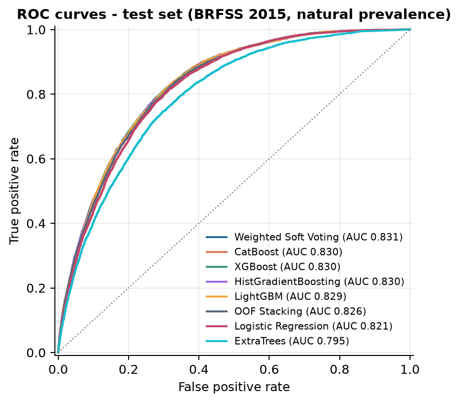
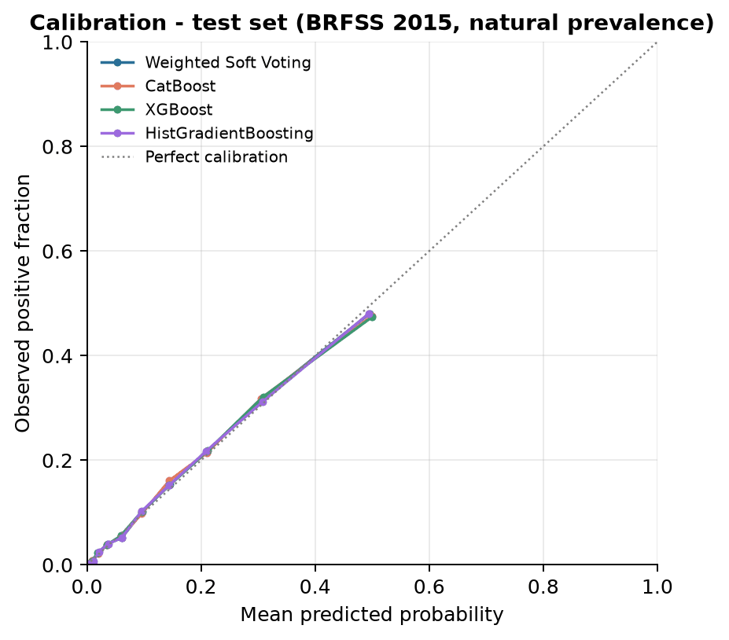
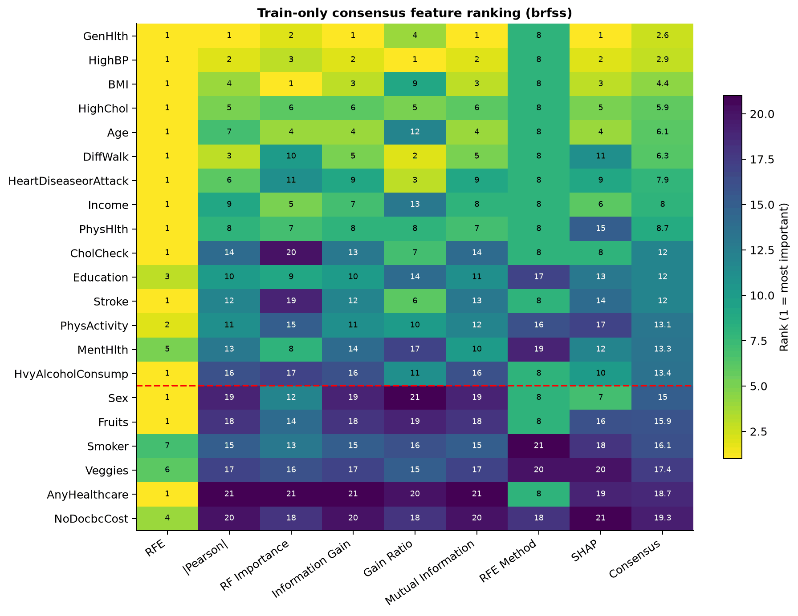
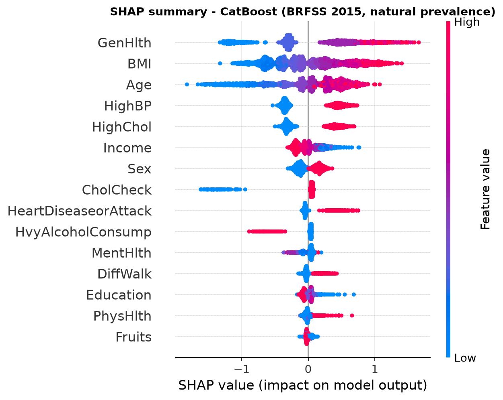
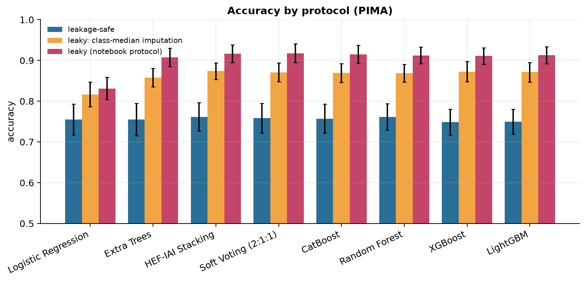

# Explainable Diabetes Risk Prediction

[](https://github.com/Laiba-Gul/explainable-diabetes-prediction/actions/workflows/ci.yml)


A reproducible, tested and explainable machine-learning pipeline for diabetes risk prediction on two public datasets:
the **CDC BRFSS 2015** health-indicator survey (253,680 respondents) and the **PIMA Indians Diabetes** dataset
(768 patients).

This repository turns my Google Colab research into a proper project:

- **One command per experiment.** Each experiment is a YAML config that the `diabetes-xai` package runs end to end:
  data download with checksum, split, feature selection, resampling, training, evaluation, figures and tables.
- **Leakage-safe evaluation.** Every learned step (feature selection, SMOTE, scaling, thresholds, ensemble weights)
  is fitted on training or validation data only. The test set is scored once, at the end.
- **Verified results.** The numbers reported in my notebooks are re-computed and compared automatically. Where
  they do not hold up, this README says so.
- **Explainability.** SHAP explanations globally (figures) and per prediction (API).
- **Serving.** A saved model bundle, a batch-prediction CLI and a FastAPI service with input validation, in Docker.

> **Not a medical device.** This is a portfolio and research project. It must not be used for diagnosis or
> treatment decisions. See the [model card](docs/MODEL_CARD.md).

---

## Contents

- [Key results](#key-results)
- [What the audit of my original notebooks found](#what-the-audit-of-my-original-notebooks-found)
- [How it works](#how-it-works)
- [Quick start](#quick-start)
- [Prediction API](#prediction-api)
- [Repository layout](#repository-layout)
- [Testing and CI](#testing-and-ci)
- [Limitations](#limitations)

---

## Key results

All numbers below are on held-out test data that was not used for any modelling decision. Brackets are 95%
bootstrap confidence intervals (200–500 resamples, set per config). Full tables (CSV, Markdown and LaTeX) are in [`results/`](results/).

### BRFSS 2015, natural prevalence (13.9% positive), test n = 38,052

| Model | ROC-AUC [95% CI] | PR-AUC | Accuracy |
|---|---|---|---|
| Weighted soft voting (5 models, weights fitted on validation) | **0.831** [0.825–0.836] | 0.430 | 0.867 |
| CatBoost | 0.830 [0.825–0.836] | 0.426 | 0.866 |
| XGBoost | 0.830 [0.825–0.836] | 0.427 | 0.866 |
| HistGradientBoosting | 0.830 [0.824–0.835] | 0.429 | 0.866 |
| LightGBM | 0.829 [0.824–0.835] | 0.426 | 0.866 |
| Out-of-fold stacking | 0.826 [0.821–0.832] | 0.420 | 0.866 |
| Logistic regression | 0.821 [0.816–0.827] | 0.398 | 0.863 |
| Extra Trees | 0.795 [0.789–0.801] | 0.370 | 0.862 |

Source: `configs/brfss_ensemble.yaml`. Thresholds here were chosen on validation data to maximise accuracy, which
is why recall is low (about 0.15). **Accuracy is a weak metric at this prevalence:** always predicting "no diabetes"
already scores 0.861. The ensemble's advantage over a single gradient-boosting model is well inside the confidence
intervals.

<p align="center">
  
  
</p>

### The served model

The API serves **CatBoost** with a decision threshold of **0.261**, chosen to maximise F1 on validation data
(`configs/serve.yaml`).

| ROC-AUC | PR-AUC | Recall | Specificity | Precision | F1 | MCC | Brier |
|---|---|---|---|---|---|---|---|
| 0.830 [0.825–0.836] | 0.426 | 0.549 | 0.869 | 0.405 | 0.466 | 0.370 | 0.097 |

Subgroup results are in the [model card](docs/MODEL_CARD.md). The most important finding there: recall for adults
aged 18–39 is only 0.175 at this threshold.

### Feature selection and explainability (BRFSS)

Seven ranking methods (|Pearson r|, random-forest importance, information gain, gain ratio, mutual information,
RFE with logistic regression, XGBoost TreeSHAP) are computed **on training rows only**, and their average rank
picks 15 of the 21 features.

<p align="center">
  
  
</p>

General health, BMI, age, high blood pressure and high cholesterol are the strongest drivers. SHAP shows what the
model learned from survey associations, not causal medical effects.

### Other BRFSS benchmarks

| Experiment | Best model | Test ROC-AUC [95% CI] | Config |
|---|---|---|---|
| Consensus top-15 features + SMOTE-NC, 7 models | CatBoost | 0.821 [0.816–0.827] | `configs/brfss_xai.yaml` |
| 50/50 balanced subset (70,692 rows), 7 models | CatBoost | 0.828 [0.820–0.835] | `configs/brfss_5050.yaml` |

Across all three BRFSS setups, the gradient-boosting models land between 0.82 and 0.83 ROC-AUC with overlapping
intervals, and logistic regression is only about 0.01 behind. The deep-learning models in my notebooks
(MLP, 1D-CNN, TabTransformer, FT-Transformer, TabNet) reached 0.814–0.819 and are not part of this package.

### PIMA: honest results with 5 × 5 repeated cross-validation

| Model | Accuracy (mean ± sd) | ROC-AUC (mean ± sd) |
|---|---|---|
| Logistic regression | 0.755 ± 0.038 | **0.839** ± 0.031 |
| Extra Trees | 0.755 ± 0.039 | 0.838 ± 0.031 |
| HEF-IAI stacking (CatBoost + XGBoost + Extra Trees → LR) | **0.762** ± 0.035 | 0.837 ± 0.032 |
| Soft voting (2:1:1) | 0.759 ± 0.037 | 0.834 ± 0.032 |
| CatBoost | 0.757 ± 0.036 | 0.831 ± 0.032 |
| Random Forest | 0.761 ± 0.033 | 0.828 ± 0.031 |
| XGBoost | 0.748 ± 0.032 | 0.827 ± 0.032 |
| LightGBM | 0.750 ± 0.031 | 0.819 ± 0.031 |

Source: `configs/pima_cv.yaml`. With 768 patients, a single 80/20 split has a standard error of roughly ±3.5
accuracy points, so repeated CV is used instead. On this small dataset the stacked ensemble is no better than
logistic regression.

---

## What the audit of my original notebooks found

Before building this package I audited all 19 of my Colab notebooks: duplicates were merged, broken or abandoned
notebooks were dropped, and every reported number was re-computed. Two things came out of it.

### 1. Most BRFSS results reproduce

| Experiment | Numbers checked | Largest difference |
|---|---|---|
| 50/50 benchmark | 42 | 0.0004 |
| Heterogeneous ensemble | 11 | 0.0009 |
| XAI benchmark | 42 | 0.110 (XGBoost only) |

In the XAI benchmark, every model matches within 0.015 **except XGBoost**. The notebook reported ROC-AUC 0.784 and
accuracy 0.791, and the package gets 0.818 and 0.846 with the same configuration. I could not recover the original
run, and the most likely cause is a change in XGBoost's defaults between library versions. The table in
`results/brfss_xai/tables/verification_reported_vs_reproduced.csv` shows every comparison.

### 2. My earlier PIMA accuracies of 91–96% were caused by data leakage

My first PIMA notebooks reported 91–96% accuracy. Re-running them showed two problems:

- **Target-based imputation.** Missing values (zeros in glucose, insulin, BMI and so on) were filled with the median
  *of each outcome class*. That writes the label into the features.
- **Resampling before splitting.** SMOTE-Tomek ran on the full dataset before the train/test split, so synthetic
  copies of test patients were in the training data.

`configs/pima_cv.yaml` measures each effect on the same folds and models:

<p align="center">
  
</p>

| Protocol | Typical tree-model accuracy |
|---|---|
| Leakage-safe (all steps inside each CV fold) | 0.75–0.76 |
| Class-median imputation only | about 0.87 |
| Original notebook protocol (both issues) | 0.91–0.92 |

Leakage inflated tree-model accuracy by **15–16 percentage points**, and logistic regression by 7.6. The leaky
CatBoost run reaches ROC-AUC 0.941, which matches the 0.942 in my notebook, so the original numbers came from the
leak and not from the models. Some figures in those notebooks were also drawn from hard-coded values rather than
model output. None of that material is published here. Every figure in this repository is generated from
predictions by the code in `src/`.

This was the most useful lesson of the project: a strong-looking number deserves the most checking.

---

## How it works

```
                    configs/*.yaml
                          │
   download + SHA-256 ────┤
                          ▼
  ┌───────────────────────────────────────────────────────────────┐
  │ split 70 / 15 / 15, stratified (or 5×5 repeated CV for PIMA)  │
  │      │ train only                                             │
  │      ▼                                                        │
  │ consensus feature selection (7 rankers) → SMOTE-NC → scaler   │
  │      │                                                        │
  │      ▼                                                        │
  │ models: LR, SVM, trees, RF, ET, HGB, XGBoost, LightGBM,       │
  │         CatBoost, stacking, validation-weighted soft voting   │
  │      │ validation only                                        │
  │      ▼                                                        │
  │ threshold + ensemble weights  →  frozen.json                  │
  │      │ test, once                                             │
  │      ▼                                                        │
  │ metrics + bootstrap CIs, ROC/PR/calibration/confusion, SHAP   │
  └──────┬───────────────────────────────────────┬────────────────┘
         ▼                                       ▼
  results/<experiment>/                  artifacts/<experiment>/
  tables (csv / md / tex), figures       model.joblib + metadata.json
  (png / pdf), summary.json                       │
                                                  ▼
                              diabetes-xai predict   ·   FastAPI /predict
```

Design choices worth noting:

- **Split before anything is learned.** Feature selection, SMOTE-NC, scaling, decision thresholds and ensemble
  weights only ever see training or validation rows.
- **SMOTE-NC respects data types.** Binary and ordinal survey answers stay valid integers, and continuous columns
  are standardised before neighbours are computed.
- **Thresholds are an explicit choice.** Policies are `fixed`, `f1`, `youden` or `accuracy`, selected on
  validation data and stored with the model.
- **Saved bundles.** A bundle holds the preprocessing pipeline, the model, the feature list, the threshold and
  metadata, so predictions never require retraining.
- **Cross-experiment report.** `diabetes-xai report` gathers every experiment into
  [`results/summary/`](results/summary/SUMMARY.md).

---

## Quick start

Requires Python 3.12 (3.10+ should work).

```bash
git clone https://github.com/Laiba-Gul/explainable-diabetes-prediction.git
cd explainable-diabetes-prediction
python -m venv .venv && source .venv/bin/activate      # Windows: .venv\Scripts\activate
make install                                           # or: pip install -r requirements-dev.txt && pip install -e .

diabetes-xai download                                  # fetch + SHA-256-verify all datasets into data/
diabetes-xai train configs/serve.yaml                  # train the served model (about 1 minute)
diabetes-xai train configs/pima_cv.yaml                # PIMA leakage study
diabetes-xai report                                    # rebuild results/summary/
```

`make train-all` runs every experiment (20–40 minutes on 2 CPU cores). Each experiment writes its results to
`results/<name>/` and, if exporting is enabled in its config, a model bundle to `artifacts/<name>/`.

**Batch prediction** from a CSV with the 21 BRFSS feature columns:

```bash
diabetes-xai predict artifacts/brfss_serve --input patients.csv --output predictions.csv --explain
```

**Google Colab:** clone the repo in a cell and run the same commands with a leading `!`. Nothing depends on Google
Drive. Paths are relative and configurable with `--data-dir`, `--results-dir` and `--artifacts-dir`.

---

## Prediction API

```bash
make api                                  # local: http://localhost:8000/docs
# or
docker build -t diabetes-xai . && docker run --rm -p 8000:8000 diabetes-xai
```

The Docker build trains the served model in a separate build stage and copies only the bundle into a slim,
non-root runtime image.

| Method | Path | Purpose |
|---|---|---|
| `GET` | `/health` | Liveness and readiness check. Returns 503 if no model is loaded. |
| `GET` | `/model/info` | Model type, version, features, threshold and test metrics |
| `POST` | `/predict?explain=true` | Risk probability, decision and (optionally) the top 5 SHAP factors |

```bash
curl -s -X POST "http://localhost:8000/predict?explain=true" \
  -H "Content-Type: application/json" \
  -d '{"HighBP":1,"HighChol":1,"CholCheck":1,"BMI":31,"Smoker":0,"Stroke":0,
       "HeartDiseaseorAttack":0,"PhysActivity":0,"Fruits":1,"Veggies":1,
       "HvyAlcoholConsump":0,"AnyHealthcare":1,"NoDocbcCost":0,"GenHlth":4,
       "MentHlth":2,"PhysHlth":10,"DiffWalk":1,"Sex":0,"Age":10,"Education":4,"Income":3}'
```

```json
{
  "predicted_class": 1,
  "label": "diabetes / prediabetes",
  "probability": 0.509,
  "threshold": 0.261,
  "model_version": "1.0.0",
  "top_factors": [
    {"feature": "GenHlth",  "value": 4.0,  "shap_value": 0.763, "effect": "increases risk"},
    {"feature": "HighChol", "value": 1.0,  "shap_value": 0.408, "effect": "increases risk"},
    {"feature": "Age",      "value": 10.0, "shap_value": 0.397, "effect": "increases risk"},
    {"feature": "HighBP",   "value": 1.0,  "shap_value": 0.392, "effect": "increases risk"},
    {"feature": "BMI",      "value": 31.0, "shap_value": 0.272, "effect": "increases risk"}
  ]
}
```

- **Input validation.** Pydantic enforces the BRFSS codebook ranges (binary fields 0/1, BMI 10–100, GenHlth 1–5,
  Age group 1–13 and so on) and rejects unknown fields with a 422 error.
- **Privacy in logs.** Logs are structured JSON with a request ID and latency. They never contain patient values,
  and validation errors do not echo the input.

The API runs locally and in Docker. It is not deployed to a public URL.

---

## Repository layout

```
├── src/diabetes_xai/
│   ├── datasets.py        dataset registry, checksum-verified download, validation, data audit
│   ├── features.py        consensus feature selector, SMOTE-NC wrapper, PIMA clinical features, scalers
│   ├── models.py          model factory (YAML → estimator), stacking, validation-weighted soft voting
│   ├── evaluation.py      metrics, threshold policies, bootstrap confidence intervals
│   ├── experiment.py      train / validation / test pipeline, figures, SHAP, model export
│   ├── cv_experiment.py   repeated cross-validation and leakage-protocol comparison
│   ├── plots.py           publication-quality figures (PNG + PDF, 300 dpi)
│   ├── report.py          cross-experiment summary tables and figures
│   ├── inference.py       ModelBundle: save / load / predict / explain
│   ├── cli.py             `diabetes-xai` command-line interface
│   └── api/               FastAPI app and Pydantic schemas
├── configs/               one YAML per experiment (including the numbers reported in my notebooks)
├── results/               generated tables (csv / md / tex) and figures (png / pdf)
├── notebooks/             cleaned original Colab notebooks (supporting material, see its README)
├── docs/MODEL_CARD.md     intended use, data, performance, subgroups, limitations
├── scripts/               subgroup analysis
├── tests/                 pytest suite on synthetic data (no download needed)
├── Dockerfile             multi-stage: train, then slim non-root runtime
└── .github/workflows/     lint, tests, PIMA smoke run, Docker build and API check
```

The [`notebooks/`](notebooks/) folder keeps the original research (EDA, resampling comparisons, deep-learning
models) for context. You do not need it to understand or run the project.

---

## Testing and CI

```bash
make lint      # ruff check + ruff format --check
make test      # 46 pytest tests with coverage
```

Tests run on small synthetic datasets that mimic the BRFSS and PIMA schemas. They cover data validation, feature
selection, SMOTE-NC type safety, threshold selection, ensemble weighting, a full train-evaluate-save-load cycle and
the API (validation errors, health checks, explanations).

GitHub Actions runs on every push and pull request:

1. Lint and the test suite with coverage.
2. A smoke run of the PIMA pipeline on the real, checksum-verified data.
3. A Docker build that trains the served model, starts the container and calls `/health` and `/predict`.

A second workflow, **Reproduce results** (`.github/workflows/reproduce.yml`, started by hand), re-runs every
experiment from scratch on a clean GitHub runner and commits the regenerated `results/` folder back to the
repository. The tables and figures in this repository come from that run, and any difference from my original
local run shows up in the commit history.

---

## Limitations

- **BRFSS data.** The survey is self-reported, cross-sectional, from 2015 and US-only. Its label merges
  prediabetes with diabetes.
- **PIMA data.** The dataset is small (768 patients) and covers a single population (Pima women aged 21 and over).
  Its results are a methodology demonstration, not a clinical benchmark.
- **Duplicate rows.** BRFSS has 24,206 exact duplicate rows and no respondent ID, so they are kept, and identical
  profiles can appear in both training and test data.
- **Subgroup performance.** Performance differs across age and income groups, and no fairness intervention was
  applied (see the [model card](docs/MODEL_CARD.md)).
- **Small differences between models.** Differences between the top models are smaller than the confidence
  intervals. The ensemble is not meaningfully better than a single CatBoost model.
- **Deep learning.** Deep-learning models are only in the notebooks and are not reproduced by this package.

## Data sources

The notebooks and this package use these two Kaggle datasets:

| Dataset | Kaggle page | Files used |
|---|---|---|
| **CDC Diabetes Health Indicators (BRFSS 2015)**, by Alex Teboul | [kaggle.com/datasets/alexteboul/diabetes-health-indicators-dataset](https://www.kaggle.com/datasets/alexteboul/diabetes-health-indicators-dataset) | `diabetes_binary_health_indicators_BRFSS2015.csv`, `diabetes_binary_5050split_health_indicators_BRFSS2015.csv` |
| **PIMA Indians Diabetes** | [kaggle.com/datasets/jamaltariqcheema/pima-indians-diabetes-dataset](https://www.kaggle.com/datasets/jamaltariqcheema/pima-indians-diabetes-dataset) | `diabetes.csv` (768 patients, 8 features) — the package downloads the same 768 rows without the header row |

- **BRFSS 2015** is derived from the CDC Behavioral Risk Factor Surveillance System, which is public data.
- **PIMA** originally comes from the National Institute of Diabetes and Digestive and Kidney Diseases (UCI
  repository).

The datasets are not stored in this repository. `diabetes-xai download` fetches byte-identical copies from
public mirrors (Kaggle needs a login) and verifies their SHA-256 checksums. The two BRFSS files from Kaggle can
also be placed in `data/` directly (see [`data/README.md`](data/README.md)).

## License

[MIT](LICENSE) © 2026 Laiba Gul
